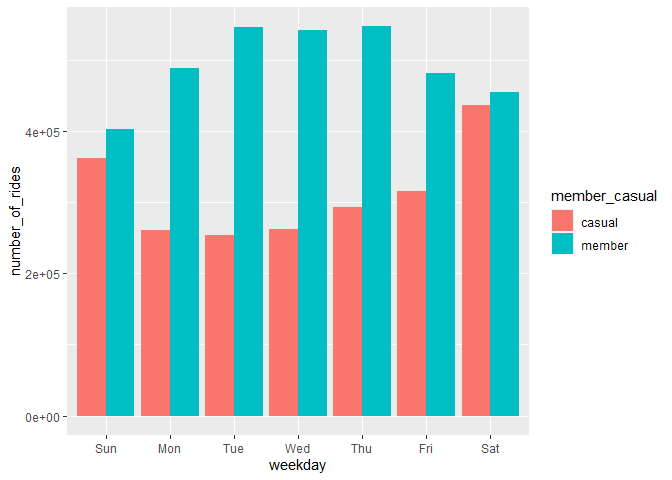
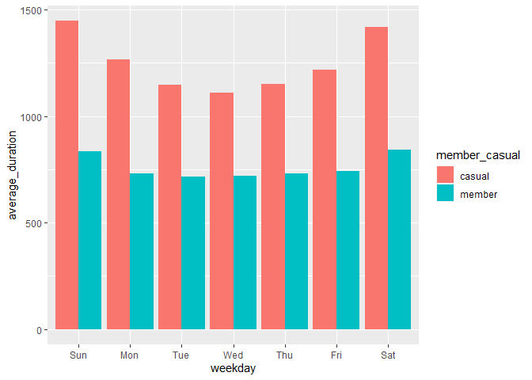

Google Data Analytics Capstone Project
================
Luca Reolon
2023-05-18

## Cyclistic Case Study

The focus of this case study is to examine an authentic public dataset
obtained from Divvy, a cooperative bike-sharing business between the
City of Chicago and Motivate International Inc. Divvy’s services are
accessible to both annual members and casual users, who can acquire a
single-ride or day pass to access the bikes located at docking stations
throughout the city. Over 5.8 million rides were taken from March 2022
to February 2023. To go through the analysis, the writing structure will
follow Google Data Analytics framework: ***ask, prepare, process,
analyze, share, and act***, utilizing R in RStudio for the entire
analysis.

# Ask

As part of this project’s analysis, our task is to provide
recommendations for marketing programs. The financial analysis suggests
that membership schemes are more lucrative than single-use payments from
casual users. Consequently, the project’s objectives are centered on:

1.  How do annual members and casual riders use Cyclist bikes
    differently?
2.  Why would casual riders buy Cyclist annual memberships?
3.  How can Cyclist use digital media to influence casual riders to
    become members?

# Prepare

In this phase, datasets were downloaded, stored, imported and then
identified. Datasets come as .csv archives for each month from March
2022 to February 2023, resulting in 12 datasets. They were imported to
RStudio and functions as `colnames()` and `str()` are used in order to
identify how data are structured and what types of data are included.

``` r
m3_2022 <- read.csv("202203-divvy-tripdata.csv")
colnames(m3_2022)
```

    ##  [1] "ride_id"            "rideable_type"      "started_at"        
    ##  [4] "ended_at"           "start_station_name" "start_station_id"  
    ##  [7] "end_station_name"   "end_station_id"     "start_lat"         
    ## [10] "start_lng"          "end_lat"            "end_lng"           
    ## [13] "member_casual"

``` r
str(m3_2022)
```

    ## 'data.frame':    284042 obs. of  13 variables:
    ##  $ ride_id           : chr  "47EC0A7F82E65D52" "8494861979B0F477" "EFE527AF80B66109" "9F446FD9DEE3F389" ...
    ##  $ rideable_type     : chr  "classic_bike" "electric_bike" "classic_bike" "classic_bike" ...
    ##  $ started_at        : chr  "2022-03-21 13:45:01" "2022-03-16 09:37:16" "2022-03-23 19:52:02" "2022-03-01 19:12:26" ...
    ##  $ ended_at          : chr  "2022-03-21 13:51:18" "2022-03-16 09:43:34" "2022-03-23 19:54:48" "2022-03-01 19:22:14" ...
    ##  $ start_station_name: chr  "Wabash Ave & Wacker Pl" "Michigan Ave & Oak St" "Broadway & Berwyn Ave" "Wabash Ave & Wacker Pl" ...
    ##  $ start_station_id  : chr  "TA1307000131" "13042" "13109" "TA1307000131" ...
    ##  $ end_station_name  : chr  "Kingsbury St & Kinzie St" "Orleans St & Chestnut St (NEXT Apts)" "Broadway & Ridge Ave" "Franklin St & Jackson Blvd" ...
    ##  $ end_station_id    : chr  "KA1503000043" "620" "15578" "TA1305000025" ...
    ##  $ start_lat         : num  41.9 41.9 42 41.9 41.9 ...
    ##  $ start_lng         : num  -87.6 -87.6 -87.7 -87.6 -87.6 ...
    ##  $ end_lat           : num  41.9 41.9 42 41.9 41.9 ...
    ##  $ end_lng           : num  -87.6 -87.6 -87.7 -87.6 -87.7 ...
    ##  $ member_casual     : chr  "member" "member" "member" "member" ...

Note that timestamps are in the `chr` format. They will be converted
later to allow calculations be executed.

Next, the function `all.equal()` is applied to all datasets in order to
check if all columns match.

``` r
all.equal(colnames(m3_2022), colnames(m4_2022), colnames(m5_2022),
          colnames(m6_2022), colnames(m7_2022), colnames(m8_2022),
          colnames(m9_2022), colnames(m10_2022), colnames(m11_2022),
          colnames(m12_2022), colnames(m1_2023), colnames(m2_2023))
```

    ## [1] TRUE

The result is `TRUE` so they are consistent, allowing them to be
combined into a single stacked dataset.

# Process

The Process phase consists on transform and clean data to further
analysis. Imported data is combined into a single worksheet named
`all_data_trips`.

``` r
library(dplyr)
all_trips <- bind_rows(m3_2022, m4_2022, m5_2022, m6_2022, m7_2022, m8_2022, m9_2022, m10_2022, m11_2022, m12_2022, m1_2023, m2_2023)
```

# Analyze

For the purpose of calculate ride lengths, columns `started_at()` and
`ended_at()` will be used. However as mentioned before they required to
be converted into numerical values and formatted accordingly. Columns
date, month, year and day_of_week are generated and converted to `num`
using `difftime()` function.

``` r
all_trips$date <- as.Date(all_trips$started_at) 
all_trips$month <- format(as.Date(all_trips$date), "%m")
all_trips$day <- format(as.Date(all_trips$date), "%d")
all_trips$year <- format(as.Date(all_trips$date), "%Y")
all_trips$day_of_week <- format(as.Date(all_trips$date), "%A")
```

Calculating ride_length:

``` r
all_trips$ride_length <- difftime(all_trips$ended_at,all_trips$started_at)
```

The function `difftime()` needs to be converted to a `num`:

``` r
is.factor(all_trips$ride_length)
```

    ## [1] FALSE

``` r
all_trips$ride_length <- as.numeric(as.character(all_trips$ride_length))
is.numeric(all_trips$ride_length)
```

    ## [1] TRUE

Checking ride_length values and removing negative numbers and zeros.
Storing into all_trips_v2 dataset

``` r
all_trips_v2 <- all_trips[all_trips$ride_length > 0,]

#checking negative numbers of v2
num_negatives <- sum(all_trips_v2$ride_length < 0)
num_zero <- sum(all_trips_v2$ride_length == 0)
print(num_negatives)
```

    ## [1] 0

``` r
print(num_zero)
```

    ## [1] 0

``` r
rm(num_negatives, num_zero)
```

By checking the rideable_type column, docked_bike is present and later
on removed

``` r
unique(all_trips_v2$rideable_type)
```

    ## [1] "classic_bike"  "electric_bike" "docked_bike"

``` r
#disconsidering docked_bikes
all_trips_v2 <- subset(all_trips_v2, rideable_type != "docked_bike")
```

Okay, now there are only classic_bike and electric_bike data types. Next
calculations are performed.

``` r
mean(all_trips_v2$ride_length) #straight average (total ride length / rides)
```

    ## [1] 955.0826

``` r
median(all_trips_v2$ride_length) #midpoint number 
```

    ## [1] 594

``` r
max(all_trips_v2$ride_length) #longest ride
```

    ## [1] 90055

``` r
min(all_trips_v2$ride_length) #shortest ride
```

    ## [1] 1

``` r
summary(all_trips_v2$ride_length)
```

    ##    Min. 1st Qu.  Median    Mean 3rd Qu.    Max. 
    ##     1.0   338.0   594.0   955.1  1052.0 90055.0

Visualizing mean ride_length for each day of the week:

``` r
aggregate(all_trips_v2$ride_length ~ all_trips_v2$member_casual, FUN = mean)
```

    ##   all_trips_v2$member_casual all_trips_v2$ride_length
    ## 1                     casual                 1272.298
    ## 2                     member                  754.902

``` r
aggregate(all_trips_v2$ride_length ~ all_trips_v2$member_casual + 
            all_trips_v2$day_of_week, FUN = mean)
```

    ##    all_trips_v2$member_casual all_trips_v2$day_of_week all_trips_v2$ride_length
    ## 1                      casual                   Friday                1218.5453
    ## 2                      member                   Friday                 743.9566
    ## 3                      casual                   Monday                1268.4823
    ## 4                      member                   Monday                 729.2864
    ## 5                      casual                 Saturday                1419.3584
    ## 6                      member                 Saturday                 842.7431
    ## 7                      casual                   Sunday                1447.9086
    ## 8                      member                   Sunday                 836.4091
    ## 9                      casual                 Thursday                1149.4737
    ## 10                     member                 Thursday                 729.4183
    ## 11                     casual                  Tuesday                1148.2011
    ## 12                     member                  Tuesday                 716.1087
    ## 13                     casual                Wednesday                1110.9281
    ## 14                     member                Wednesday                 718.3101

Visualing graphs

``` r
all_trips_v2 %>% 
  mutate(weekday = wday(started_at, label = TRUE)) %>% 
  group_by(member_casual, weekday) %>% 
  summarise(number_of_rides = n()
            ,average_duration = mean(ride_length), .groups = 'drop') %>% 
  arrange(member_casual, weekday)  %>% 
  ggplot(aes(x = weekday, y = number_of_rides, fill = member_casual)) +
  geom_col(position = "dodge")
```


<!-- -->

``` r
all_trips_v2 %>% 
  mutate(weekday = wday(started_at, label = TRUE)) %>% 
  group_by(member_casual, weekday) %>% 
   summarise(number_of_rides = n(), average_duration = mean(ride_length), 
             .groups = 'drop') %>% 
  arrange(member_casual, weekday)  %>% 
  ggplot(aes(x = weekday, y = average_duration, fill = member_casual)) +
  geom_col(position = "dodge")
```

<!-- -->
